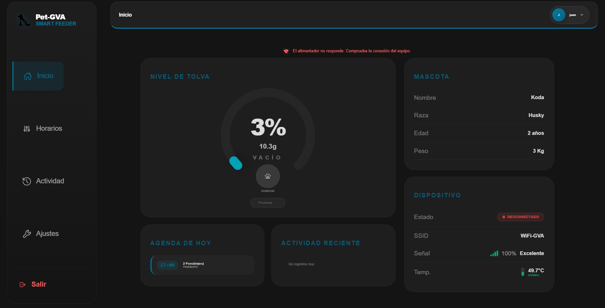
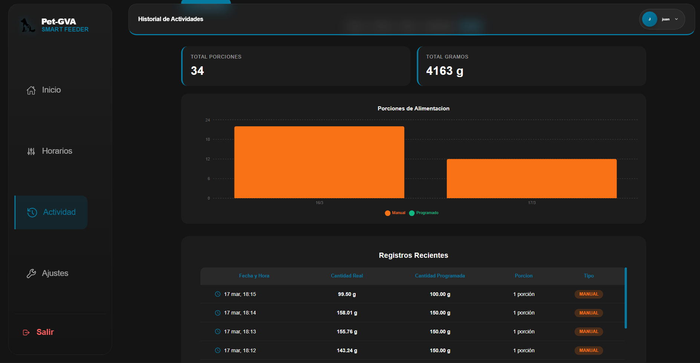
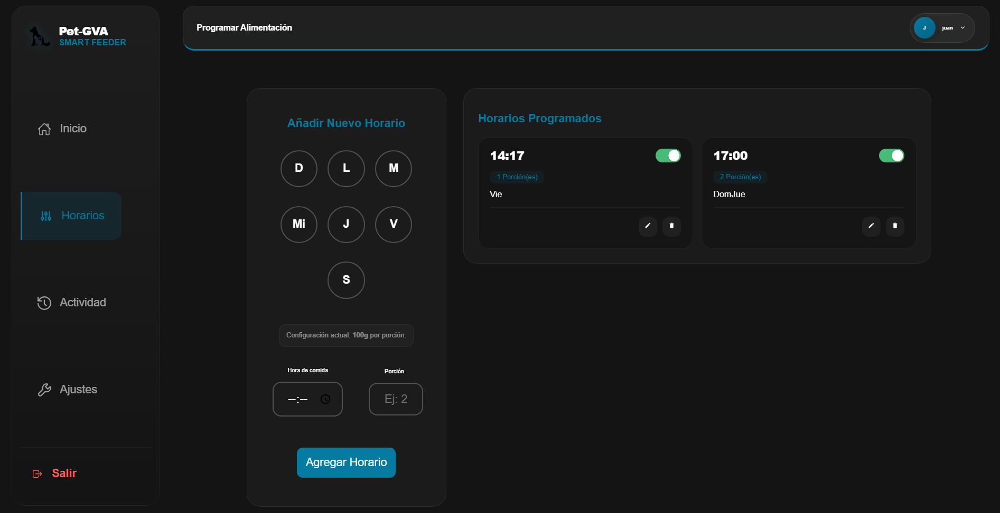
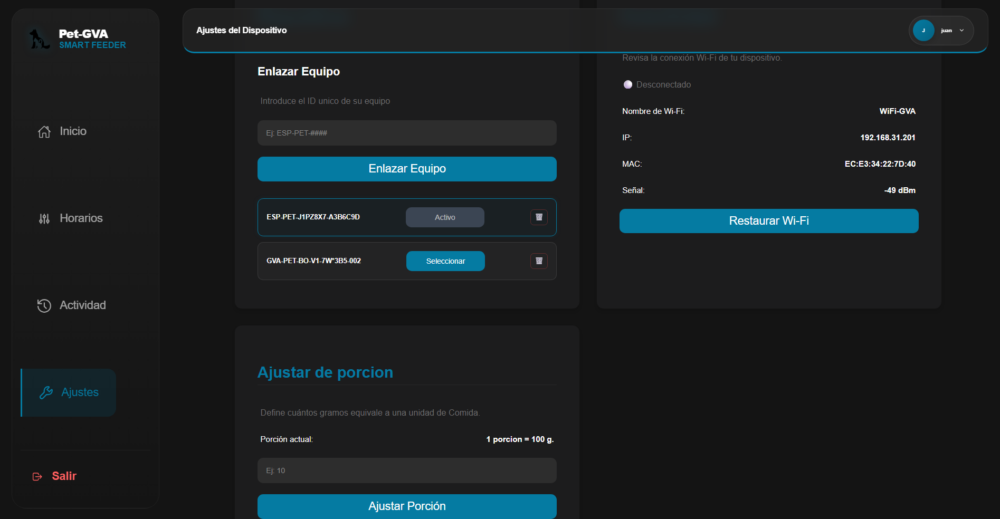

# 🐾 Smart Pet Feeder - Web Dashboard (React)

Interactive interface for the **GVA System** IoT ecosystem. This dashboard allows real-time monitoring, remote feeding triggers, and automated scheduling for pets.

**[[Live Demo Link Here](https://gva-smartfeed.vercel.app/)]**

## 🚀 Key Technologies

- **React 18 & Vite:** High-performance, reactive user interface.
- **SASS:** Modular and maintainable styling.
- **Firebase (Firestore & Auth):** Real-time synchronization and secure user access.

## 🏗️ System Architecture

This repository is the **Frontend Layer** of a complete End-to-End IoT solution:

- **Frontend (This repo):** Handles user commands and telemetry visualization.
- **[[Link to Node.js Middleware](https://github.com/GVA-987/pet-feeder-backend.git)]:** Acts as a bridge between Firebase and MQTT protocol.
- **[[Link to ESP32 Firmware](https://github.com/GVA-987/device-pet-feederESP32.git)]:** Hardware control and sensor data acquisition.

## ✨ Features

- **Manual Control:** Trigger the dispensing motor remotely with custom portions.
- **Smart Scheduling:** Program automatic feeding times synchronized with the cloud.
- **Real-time Telemetry:** Live feedback of device status and sensor history.

## 📸 Preview & Telemetry Visualization

The dashboard provides comprehensive control and real-time data visualization.

|                    **Main Dashboard & Control**                     |                   **Activity History & Telemetry**                    |
| :-----------------------------------------------------------------: | :-------------------------------------------------------------------: |
|  |  |
|           _Real-time status and manual feeding trigger._            |      _Historical data of feeding portions and grams dispensed._       |

|                         **Scheduling System**                         |                   **Device Settings & Network**                    |
| :-------------------------------------------------------------------: | :----------------------------------------------------------------: |
|  |  |
|        _Automated feeding plans synchronized with the cloud._         |  _Hardware configuration, Wi-Fi status, and portion calibration._  |
